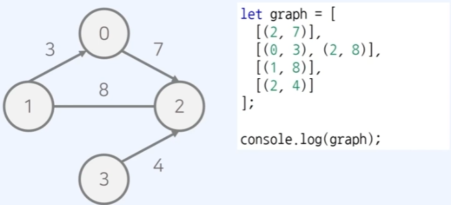
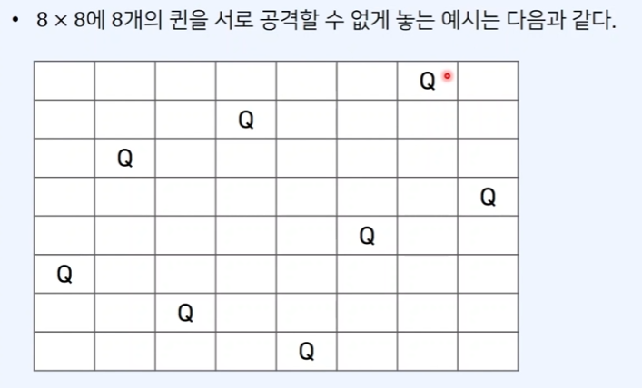

# 🤓 JavaScript로 알고리즘 공부하기 💯

## 시작하기 전에...

- **Tool**🛠️ 은 `vscode` 를 사용할 예정
- `vscode`의 `Code Runner` **extension**을 설치

<br/>
<hr/>

## 📕 목 록

#### [1. 시간 복잡도란?](#)

#### [2. 입출력에 따른 팁](#)

#### [3. 알고리즘에 주로 등장하는 JavaScript 문법](#)

<br/>

---

###### 20230327

> ## 1. 시간 복잡도란?

<br/>

## 시간 복잡도

- 알고리즘 성능을 나타내는 척도
- 특정한 크기 입력에 대하여 알고리즘의 수행 시간 분석
- 동일한 기능을 수행하는 알고리즘이 있다면, 복잡도가 낮을수록 우수함
- **빅오 표기법 (Big-O Notation)** 을 사용해 나타냄

<br/>

## 빅오 표기법

- 가장 빠르게 증가하는 항만 고려하는 표기법, 함수의 상한을 나타냄
- 연산횟수가 3N^3 + 5N^2 + 5000 의 알고리즘이 있으면 3N^3 의 증가량이 제일 크므로 큰 항만 고려함
- **Big-O Notation**에서는 가장 큰 항의 계수를 제외하여 표기함

<br/>

| 시간 복잡도 | 의미                             |
| ----------- | -------------------------------- |
| O(1)        | 상수시간 (constant time)         |
| O(*log*N)   | 로그 시간 (log time)             |
| O(N)        | 선형 시간 (linear time)          |
| O(N*log*N)  | 로그 선형 시간 (log-linear time) |
| O(N^2)      | 이차 시간 (quadratic time)       |
| O(N^3)      | 삼차 시간 (cubic time)           |
| O(2^N)      | 지수 시간 (exponential time)     |

<br/>

문제에서 가장 먼저 확인해야 하는 내용은 **시간 제한** 이다. 시간제한에 따라 범위값을 보면 알수 있음.

- 입력 값의 범위가 500 인 경우 => 시간 복잡도가 `O(N^3)` 인 알고리즘이 최적
- 입력 값의 범위가 2,000 인 경우 => 시간 복잡도가 `O(N^2)` 인 알고리즘이 최적
- 입력 값의 범위가 100,000 인 경우 => 시간 복잡도가 `O(N*log*N)` 인 알고리즘이 최적
- 입력 값의 범위가 10,000,000 인 경우 => 시간 복잡도가 `O(N)` 인 알고리즘이 최적

<br/>

> ## 2. 입출력에 따른 팁

<br/>

**JavaScript 에서 입력방식은 여러가지가 존재한다.**

<br/>

- 모든 코딩테스트 문제에는 입력과 출력이 주어지며 정해진 폼에 맞춰서 입출력을 받는것이 관건
- JavaScript는 `template-return` 을 적절히 사용할 수 있다.

```JS
    value = 35;
    console.log(`정답은 ${value}`); //template-return
```

<br/>

- `console.log` 를 사용을 남발하면 출력 때문에 시간초과에 빠질 수 있으므로 문자열을 **뭉쳐서** 반환 하는 것이 좋다.

```JS
    let answer = "";
    for(let i = 0; i < 100; i++) {
        answer += i = "\n"; // 문자열 값을 answer 에 일일히 "뭉쳐서" 반환
    }

    console.log(answer);
```

**FS-module**

- 입력데이터가 **텍스트 파일** 형태로 주어지는 경우, `Fs-module` 을 사용한다. (파일시스템 모듈)

```JS
    let fs = require('fs');
	let input = fs.readFlieSync('/dev/stdin').toString().split('\n'); // /dev/stdin 파일의 텍스트를 읽어오는 경우

    console.log(input);
```

**readline-module**

- 한줄씩 입력받아서 처리하는 `Interface`를 따로 만들어 사용도 가능

```JS
	const rl = require.('readline').createInterface({
		input: process.stdin,
		output: process.stdout,
	});

	let input = [];
	rl.on('line', (line) => {
		// 콘솔 입력창에서 줄바꿈(enter)를 입력 시 호출
		input.push(line);
	}).on('close', () => {
		// 콘솔 입력창에서 Ctrl + C or Ctrl + D 입력 시 호출
		console.log(input);
		process.exit();
	});
```

<br/>

> ## 3. 알고리즘에 주로 등장하는 JavaScript 문법

<br/>

**Array.prototype.reduce()**

- reduce() 함수는 기본적으로 reducer() 를 가지며, reducer 는 두 개의 args 를 갖는다 (accumulator, currentValue)

- 배열에 사용하며 각 원소 값은 currentValue 에 해당
- reduce 함수의 return 값은 그 이후 accumulator 로 반환 함
- 배열의 모든 원소에 대해 특정한 연산을 순차적으로 적용할 때 사용

```JS
	let data = [5,2,9,8,4];
	let minValue = data.reduce((a, b) => Math.min(a,b));
	console.log(minValue); // 2

	let summary = data.reduce((a, b) => a + b );
	console.log(summary); // 28
```

<br/>
<br/>

**fill()**

fill() 함수를 사용해 배열을 간단하게 초기화 할 수 있다.

```JS
	let arr = [8,1,4,5,7]; // 직접 초기화
	let arr = new Array(5).fill(0); // 배열을 새로 5 로 만들어 0을 채워 넣은 배열로 초기화
```

<br/>
<br/>

**Set()**

특정 원소의 등장여부를 파악할 때 집합 자료형`Set`을 효과적으로 사용할 수 있다.

- 중복된 원소를 포함하지 않는다는 것이 특징

```JS
	let mySet = new Set(); // 집합 객체 선언

	mySet.add(3);
	mySet.add(5);
	mySet.add(7);
	mySet.add(3);

    console.log(`원소의 갯수 : ${mySet.size}`); // 3
    console.log(`원소는 7을 포함하고 있는가 ? ${mySet.has(7)}`); // true

    mySet.delete(5); // 원소 제거

    for (let item of mySet) console.log(item); // 원소를 하나씩 출력
```

<br/>
<br/>

**fixed()**

실수를 출력할 때 `fixed()`를 사용해 소수점 아래 특정자리에서 반올림 할 수 있다.

```JS
	let x = 123.456;
	console.log(x.toFixed(2)); // 소숫점 둘째자리까지 출력 => 123.45
```

<br/>
<br/>

**Map**

`Map` 은 데이터 값을 key 와 value 로 가진다.

```JS
	let numbers = new Map();
	for (let i = 0; i < newArray.length; i++) {
	numbers.set(newArray[i], i); // map 으로 key 와 value 값으로 세팅
	}
	for (x of array) {
	logs += `${numbers.get(x)} `;
	}
```

<br/>

---

###### 20230328

> ## 4. fs-module 활용하기

<br/>

## fs-module 사용시 /dev/stdin 을 찾을 수 없다는 error 발생

<br/>

- `fs-module`으로 `/dev/stdin`에 접근을 할 수 없는 error.
- **Mac, Linux**는 유닉스 기반 운영체제로, /dev/stdin 으로 인해 터미널 상에서 데이터값을 입력 할 수 있음
- 하지만 **Window**운영체제는 불가능 하기 때문에 외부에 `input.txt` 파일을 만들어 따로 접근해야 한다.

<br/>

```JS
const fs = require("fs");
const filePath = process.platform === "linux" ? "/dev/stdin" : "./input.txt";
// Mac, Linux 는 유닉스 기반이라 /dev/stdin 으로 인해 터미널 상에서 데이터값을 입력 할 수 있음
// 하지만 window는 불가능하기 때문에 /input.txt 파일을 따로 만들어서 테스트 해주어야 함
let input = fs.readFileSync(filePath).toString().split("\n");
// fs-module 을 사용하여 입력값 받아오기
let line = input[0].split(" ");
let a = parseInt(line[0]);
let b = parseInt(line[1]);
console.log(a + b);
```

<br/>

## 각자리 숫자 합을 곱하는 예제 풀이

<br/>

- [문제](https://www.acmicpc.net/problem/2588)
- 각자리 숫자를 접근 할 시 문자열 값에 접근 하는 것이 제일 간단한 방법

```JS
/*-- 중략 --*/
let a = line[0];
let b = line[1];

b_1 = b[2]; // 각 자릿 수 값은 문자열의 특성을 이용해 쉽게 구현 가능
b_10 = b[1];
b_100 = b[0];

console.log(Number(a) * Number(b_1));
console.log(Number(a) * Number(b_10));
console.log(Number(a) * Number(b_100));
console.log(Number(a) * Number(b));
```

<br/>

###### 20230402

> ## 5. 자료구조

<br/>

## 자료구조 (Data-Structure) 란?

<br/>

- **자료구조**는 다수의 데이터를 담기 위한 구조
- 데이터의 수가 많아질수록 효율적인 자료구조가 필요
- 자료구조를 제대로 사용하려면 **성능 측정 방법**에 대한 이해를 할 필요가 있음
- 제대로 활용하지 못하면 불필요하게 메모리를 낭비하게 됨
- **시간복잡도**(연산 횟수) 와 **공간복잡도**(메모리의 양)를 활용해 프로그램의 성능을 측정함
- 일반적으로 10억번 연산을 하게 되면 1초 이상이 소요 됨

<br/>

## 자료구조의 종류

<br/>

| 선형구조    | 비선형 구조 |
| ----------- | ----------- |
| 배열 _O(1)_ | 트리        |
| 연결 리스트 | 그래프      |
| 스택        |             |
| 큐          |             |

<br/>

## 선형 자료구조 (Linear Data Structure)

<br/>

- 선형 자료구조는 **하나의 데이터 뒤에 다른 데이터 하나**가 존재하는 구조
- 데이터가 일렬 (연속적) 으로 연결되어 있다

<br/>

## 비선형 자료구조 (Non-linear Data Structure)

<br/>

- 비선형 자료구조는 **하나의 데이터 뒤에 여러개의 다른 데이터**가 존재하는 구조
- 데이터가 일직선으로 연결되어 있지 않아도 된다

<br/>
<hr/>
<br/>

> ## 배열과 리스트

<br/>

## 배열 (Array)

<br/>

- 가장 기본적인 자료구조. 특정 인덱스에 직접접근 가능 _O(1)_
- 컴퓨터 안에서 배열은 공각이 연속적으로 할당 됨
- **캐시 히트** 가능성이 높으며 조회가 빠르다.
- 배열의 크기를 미리 지정해야 하므로 데이터 추가 삭제에 한계가 있다.
- 자바스크립트에서는 **배열, 스택**을 사용할 때 사용할 수 있으며 **큐**를 사용할 때엔 별도로 사용

<br/>

<br/>
<br/>

## 연결 리스트 (Linked-List)

<br/>

- 배열의 구조지만 메인 메모리상 주소가 연속적이지 않음
- 배열과 다르게 크기가 정해져있지 않고 리스트의 크기를 동적으로 변환 가능
- **포인터** 를 사용해 다음 데이터의 위치를 가리키기 때문에 삽입과 삭제가 간편함
- 특정 원소를 검색 시 앞의 데이터 부터 찾아야 하므로 데이터 검색속도가 느림
- 자바스크립트에서는 **동적 배열**의 기능을 제공하기 때문에 사용하지 않아도 됨

<br/>

<br/>

```JS
	let array_1 = [];
	let array_2 = new Array();
	// 배열을 생성하는 두가지 방법

	array_1.push(1);
	array_1.push(2);

	console.log(array_1); // [1, 2];

	let array_3 = [1, 2, 3, "A", true]; // JS 의 배열은 타입에 상관없이 값을 넣을 수 있음
```

<br/>

크기가 N x M 인 2차원 배열 만드는 방법

<br/>

```JS
	// 값을 직접 입력하여 만들기
	let array = [
		[0,1,2,3],
		[0,1,2,3],
		[0,1,2,3],
	]

	console.log(array);
	/*
		[
			[0,1,2,3],
			[0,1,2,3],
			[0,1,2,3],
		]
	*/

	// ES6 문법으로 만든 2차원 배열
	let array = Array.from(Array(4), ()=> new Array(5));
	console.log(array);

	/*
		[
			[ <5 empty items> ],
			[ <5 empty items> ],
			[ <5 empty items> ],
		]
	*/

	let array = new Array(3);
	for(let i = 0; i < array.length; i++) {
		array[i] = Array.from({
			length: 4,
		} (undefined, j) => i * 4 + j);
	}
	console.log(array);

	/*
		[
			[0,1,2,3],
			[4,5,6,7],
			[8,9,10,11],
		]
	*/
```

<br/>

**concat()**

- 여러개의 배열을 이어붙여서 합친 결과를 반환 한다 _O(N)_

```JS
	let array_1 = [1,2,3,4,5];
	let array_2 = [6,7,8,9];
	let new_array = array_1.concat(array_2,[11,12], [13]);

	console.log(new_array);
	/*
		[
			1,2,3,4,5,6,7,8,9,11,12,13
		]
	*/
```

<br>

**slice()**

- 특정 구간의 원소를 꺼낸 배열을 잘라서 반환 _O(N)_

```JS
	let array = [1,2,3,4,5];
	let result = array.slice(2,3);
```

<br>

**indexOf()**

- 특정한 값을 가지는 원소의 가장 먼저 찾은 index 값을 반환 _O(N)_

```JS
	let array =  [7,3,5,6,6,2,1];

	console.log(array.indexOf(5)); // 2
	console.log(array.indexOf(6)); // 3
	console.log(array.indexOf(8)); // -1 없으면 -1 반환
```

<br/>
<hr/>
<br/>

> ## 스택과 큐

<br/>

## 스택 (Array)

<br/>

- 먼저 들어온 데이터가 나중에 나가는 자료구조, **LIFO(Last-In-First-Out)**
- 새 원소를 삭제할 때는 마지막 원소가 삭제 되는 형식

<br/>

<br/>

| 연산              | 시간 복잡도 | 설명                                                   |
| ----------------- | ----------- | ------------------------------------------------------ |
| 삽입 (push)       | _O(1)_      | 스택에 원소를 삽입하는 연산                            |
| 추출 (pop)        | _O(1)_      | 스택에 원소를 추출하는 연산                            |
| 최상위 원소 (Top) | _O(1)_      | 스택에 최상위 원소(마지막에 들어온 원소) 확인하는 연산 |
| Empty             | _O(1)_      | 스택이 비어있는지 확인 하는 연산                       |

<br/>

**일반적으로 스택을 구현할 때, 자바스크립트에선 배열(array) 자료형을 사용한다.**

```JS
	let stack = [];

	stack.push(5);
	stack.push(2);
	stack.push(3);
	stack.push(7);
	stack.pop();
	stack.push(1);
	stack.push(4);
	stack.pop();

	let reversed = stack.slice().reverse(); // stack 을 잘라서 바열로 재생성 및 뒤집기
	console.log(reversed); // [1,3,2,5]
	console.log(stack); // [5,2,3,1]
```

<br/>

## 큐 (Queue)

<br/>

- 먼저 들어온 데이터가 먼저 나가는 자료구조, **FIFO(First-In-First-Out)**
- 자바스크립트에서는 **Dictionary** 자료형을 사용하면 간단하게 구현 가능

```JS
// Queue class 생성
	class Queue {
		constructor() {
			this.items = {}; // Dirctionary 자료형으로 보관
			this.headIndex = 0;
			this.tailInedex = 0;
		}

		enqueue(item) {
			this.items[this.tailIndex] = item; // dictionary 에 key 와 value 값으로 값 저장
			this.tailIndex++;
		}

		dequeue() {
			let item = this.items[this.headIndex];
			delete this.items[this.headIndex]; // dictionary 에 해당하는 key 값을 삭제
			this.headIndex++;
			return item;
		}

		peek() {
			return this.items[this.headIndex];
		}

		getLength() {
			return this.tailIndex - this.headIndex;
		}
	}

	// 구현된 Queue class를 큐에 적용

	queue = new Queue();

	queue.enqueue(5);
	queue.enqueue(2);
	queue.enqueue(3);
	queue.enqueue(7);
	queue.dequeue();
	queue.enqueue(1);
	queue.enqueue(4);
	queue.dequeue();

	while(queue.getLength != 0) {
		console.log(queue.dequeue()); // 3 7 1 4
	}
```

<br/>

### **⛔ 여기서 잠깐 ⚠️⚠️⚠️ Dictionary 자료형에 대해 알아보자**

<br>

```JS
// Dictionary 사용하는 방법
var dictObject = {}
dictObject['banana'] = '바나나';
dictObject['hong'] = '홍';
dictObject['monkey'] = '원숭이';
console.log(dictObject) // Object {banana: "바나나", hong: "홍", monkey: "원숭이"}

// Dictionary 출력
for (var key in dictObject) {
  console.log("key : " + key +", value : " + dictObject[key]);
}

// Dictionary 추가, 제거
dictObject['elephant'] = '코끼리'; // 추가
delete dictObject['elephant']; // 삭제 (제대로 삭제 되면 true, 아니면 false)

// 모든 key를 가져오는 방법
Object.keys(dictObject); // ["banana", "hong", "monkey"]

// Dictionary 길이 구하는 방법
Object.keys(dictObject).length; // 3

// key를 체크하는 방법
"moneky" in dictObject // true
"elephant" in dictObject // false

// key의 마지막 값 가져오는 방법
var lastKey = Object.keys(dictObject)[Object.keys(dictObject).length - 1]
console.log("last key = " + lastKey);
// monkey
```

<br/>
<hr/>
<br/>

> ## 트리와 우선순위 큐

<br/>

## 트리 (Tree)

<br/>

- 루트노드(root-node) : 부모가 없는 최상위 노드
- 단말노드(leaf-node) : 자식이 없는 최하위 노드

<br/>

- 트리에서는 부모와 자식 관계가 성립함, 형제관계도 성립
- 깊이는 루트노드에서의 길이를 의미함
- 출발 노드에서 목적지 노드까지 거쳐야되는 간선의 수를 의미

<br/>
<br/>

<br/>
<br/>

**이진트리 (Binary-Tree)**

- 최대 자식 수를 두개 가질 수 있는 트리

<br/>

## 우선순위 큐(Priority Queue)

<br/>

- 우선순위 큐는 우선순위에 따라서 데이터를 추출 하는 구조
- 일반적으로 **힙(Heap)**을 이용해 구현한다.

<br/>

| 자료구조                     | 추출되는 데이터             |
| ---------------------------- | --------------------------- |
| 스택 (Stack)                 | 가장 나중에 삽입 된 데이터  |
| 큐 (Queue)                   | 가장 먼저 삽입 된 데이터    |
| 우선순위 큐 (Priority Queue) | 가장 우선순위가 높은 데이터 |

<br/>

- 우선순위 큐는 다양한 방법으로 구현 할 수 있음
- 데이터 갯수가 N 개 일 시 구현 방식에 따른 시간 복잡도는 다음과 같음

| 우선순위 큐 방식 | 삽입 시간 | 삭제 시간 |
| ---------------- | --------- | --------- |
| 리스트 자료형    | _O(1)_    | _O(N)_    |
| 힙               | _O(logN)_ | _O(logN)_ |

<br/>

- 일반적인 큐는 선형적 구조를 가지지만 우선순위 큐는 **이진트리** 형
- 이진트리도 종류가 다양함

<br/>

| 트리 종류                             | 설명                                                                 |
| ------------------------------------- | -------------------------------------------------------------------- |
| 완전 이진트리 (Complete Binary-tree)  | 모든 노드가 왼쪽 자식부터 채워지는 이진 트리                         |
| 포화 이진트리 (Full Binary-tree)      | 리프노드를 제외한 모든 노드가 두 자식을 가지고 있는 이진 트리        |
| 높이 균형 트리 (Height balanced tree) | 왼쪽 자식 트리와 오른쪽 자식 트리가 높이가 1 이상 차이나지 않는 트리 |

<br/>

## 힙 (Heap)

<br/>

- 힙(Heap) 은 원소들 중에서 최댓값 혹은 최솟값을 빠르게 찾아내는 구조
- 최대 힙(max-heap) 은 값이 큰 값부터 찾아내는 힙, 최소 힙(min-heap) 은 값이 작은 값부터 찾아내는 힙
- 힙은 원소 삽입과 삭제를 위해 _O(logN)_ 의 수행시간을 요구함
- 단순한 N개의 데이터를 힙에 넣었다가 모두 꺼내는 작업은 정렬과 동일
- 이 경우 시간 복잡도는 _O(NlogN)_

<br/>

- 힙은 **완전 이진트리** 자료구조를 따름
- 힙에서는 가장 우선순위가 높은 노드가 루트(root) 에 위치 함
- 최대 힙(max-heap) 은 최상위 루트가 제일 값이 큼, 큰 데이터가 우선순위가 높음
- 최소 힙(min-heap) 은 최상위 루트가 제일 값이 작음, 작은 데이터가 우선순위가 높음

| 힙의 종류          | 설명                                                 |
| ------------------ | ---------------------------------------------------- |
| 최대 힙 (Max Heap) | 부모노드가 자식 노드보다 큰 **완전 이진트리**를 의미 |

<br/>

**최소 힙 구성함수 : Heapify**

- 부모로 거슬러 올라가며, 힙에 맞지 않은 값일 경우 부모와 자식의 값을 교체
- 새로운 원소가 삽입 되었을 때, _O(logN)_ 의 시간복잡도로 힙 성질을 유지할 수 있다.

<br/>
<br/>

<br/>
<br/>
<p>


</p>

- 수정 이후 루트노드에서부터 하향식으로 `heapify()`를 진행 해주어야 한다
- 자바스크립트에서 우선순위 큐를 라이브러리로 제공하지 않음
- 최단경로 알고리즘 등에서 **힙(Heap)** 이 필요한 경우 **별도라이브러리를 사용** 해야한다. [참고](https://github.com/ndb796/priorityqueuejs)

<br/>

```JS
	// 최대 힙(Max Heap)
	let pq = new PriorityQueue((a,b) => return a.cash - b.cash);

	pq.enq({cash: 250, name: "kim"});
	pq.enq({cash: 300, name: "Hong"});
	pq.enq({cash: 150, name: "Han"});

	console.log(pq.size()); // 3
	console.log(pq.deq()); // {cash: 300, name: "Hong"}
	console.log(pq.peek()); // {cash: 250, name: "kim"}
	console.log(pq.size()); // 2
```

<br/>

###### 20230402

<br/>

## 그래프 (Graph)

<br/>

- **그래프** 란 사물을 정점(vertex)과 간선(edge)로 나타내기 위한 도구
- 그래프는 두가지 방식으로 구현 가능

1. `인접행렬(adjacency matrix)` : 2차원 배열을 사용하는 방식
2. `인접 리스트(adjacency list)` : 연결리스트를 사용하는 방식

<br/>

**인접행렬**

<br/>

- 인접행렬은 2차원 배열을 사용함
- 0 에서 0 으로 가는 거리는 0, 0 에서 1 로 가는 거리는 3
- 다만 같은 **형제 노드끼리는 간선이 없기 때문에 무한**

<br/>

<br/>

**인접행렬 - 무방향 무가중치 그래프**

<br/>

- 모든 간선이 방향성을 가지지 않는 그래프를 무방향 그래프라고 한다.
- 모든 간선에 가중치가 없는 그래프를 무가중치 그래프라고 한다.
- **무방향 비가중치 그래프**가 주어졌을 때 연결되어 있는 상황을 인접행렬로 출력 할 수 있다.

<br/>

<br/>

**인접행렬 - 방향 가중치 그래프**

<br/>

- 모든 간선이 방향성을 가지는 그래프를 방향 그래프라고 한다.
- 모든 간선에 가중치가 있는 그래프를 가중치 그래프라고 한다.
- **방향 가중치 그래프**가 주어졌을 때 연결되어 있는 상황을 인접행렬로 출력 할 수 있다.

<br/>

<br/>

**인접 리스트**

<br/>

- 인접리스트에서는 그래프를 리스트로 표현 함

<br/>

<br/>

**인접 리스트 - 무방향 무가중치 그래프**

<br/>

- 모든 간선이 방향성을 가지지 않는 그래프를 무방향 그래프라고 한다.
- 모든 간선에 가중치가 없는 그래프를 무가중치 그래프라고 한다.
- **무방향 비가중치 그래프**가 주어졌을 때 연결되어 있는 상황을 인접행렬로 출력 할 수 있다.

<br/>

<br/>

**인접 리스트 - 방향 가중치 그래프**

<br/>

- 모든 간선이 방향성을 가지는 그래프를 방향 그래프라고 한다.
- 모든 간선에 가중치가 있는 그래프를 가중치 그래프라고 한다.
- **방향 가중치 그래프**가 주어졌을 때 연결되어 있는 상황을 인접행렬로 출력 할 수 있다.

<br/>

<br/>
<br/>
<hr/>

인접 행렬

- 모든 정점들의 연결 여부를 2차원 배열로 저장하기 때문에 _O(V^2)_ 의 공간을 요구함
- 공간 효율성은 떨어지지만 두 노드의 연결 여부를 빠르게 확인 가능 _O(1)_

인접 리스트

- 연결 된 간선의 정보만 입력하여 _O(V + E)_ 의 공간만 요구함
- 공간 효율성이 우수하지만 두 노드의 연결 여부를 확인 할 땐 _O(V)_ 의 시간이 필요함

<br/>

|             | 필요한 메모리 | 연결 여부 확인 |
| ----------- | ------------- | -------------- |
| 인접 행렬   | _O(V^2)_      | _O(1)_         |
| 인접 리스트 | _O(V + E)_    | _O(V)_         |

<br/>

**최단 경로 알고리즘을 구현 할 때 간선 갯수가 적은 인접 리스트가 유리**

<br/>
<br/>

> ## 6. 정렬 알고리즘

<br/>

## 선택정렬 (selection-sort)

<br/>

- 선택정렬은 매 단계에서 가장 작은 원소를 선택해서 앞으로 보내는 정렬방법
- 앞으로 보내진 원소는 더이상 위치가 변경되지 않음
- 시간복잡도는 _O(N^2)_ 로 **비효율적**

<br/>

알고리즘 방식

1. 각 단계에서 가장 작은 원소를 하나 선택
2. 처리되지 않은 원소들 중 가장 앞의 원소와 교체

<br/>

<br/>

```JS
	// 선택정렬 함수
	function selectionSort(array) {
		for(let i = 0; i < array.length; i++) {
			let minIndex = i; // 가장 작은 원소의 index

			for(let j = i + 1; j < array.length; j++) {
				if(array[j] < array[minIndex]) {
					minIndex = j;
				}
			} // 최솟값 재지정

			// 교체 (swap)
			let temp = array[i];
			array[i] = array[minIndex];
			array[minIndex] = temp;
		}
	}
```

<br/>

## 버블정렬 (bubble-sort)

<br/>

- 단순히 인접한 두 원소를 확인해 정렬이 안되어 있다면 서로 변경
- 시간복잡도가 _O(N^2)_ 으로 비효율적인 정렬 알고리즘 중 하나

<br/>

알고리즘 방식

1. 인접한 인덱스의 값과 비교
2. 비교한 인덱스의 값을 서로 정렬

<br/>

<br/>

```JS
	// 버블정렬 함수
	function bubbleSort(array) {
		for(let i = array.length -1; 0 < i; i--) {
			for(let j = 0; j < i; j++) {
				if(array[j] < array[j + 1]) {
					let tmp = array[i];
					array[j] = array[j+1];
					array[j+1] = tmp;
				}
			}
		}
	}

```

<br/>

## 삽입정렬 (insert-sort)

<br/>

- 각 값을 적절한 위치에 집어넣는 정렬 기법

<br/>

알고리즘 방식

1. 각 단계에서 현재 원소가 삽입 될 위치를 찾음
2. 적절한 위치에 도달 할 때 까지 반복적으로 **왼쪽으로** 이동
3. 삽입 정렬을 수행 할 때 첫 원소는 정렬이 되어 있다고 가정

<br/>

<br/>

```JS
	// 삽입정렬
	function insertionSort(array) {
		for(let i = 1; i < array.length; i++) {
			for(let j = i; 0 < j; j--) {
				// index j 부터 1까지 1씩 감소하며 반복
				if(array[j] < array[j-1]) {
					// 한칸씩 왼쪽으로 이동
					// 교체 swap
					let tmp = array[j];
					array[j] = array[j-1];
					array[j-1] = tmp;
				} else break; // 자기보다 작은 데이터를 만나면 그 위치에서 멈춤
			}
		}
	}

```

<br/>

## 병합정렬 (merge-sort)

<br/>

- 병합 정렬은 전형적인 **분할정복(divide and conquer)** 알고리즘

| 동작          | 방식                                               |
| ------------- | -------------------------------------------------- |
| 분할(divide)  | 큰 문제를 작은 부분문제로 분할                     |
| 정복(conquer) | 작은 부분 문제를 각각 해결                         |
| 조합(combine) | 해결한 부분 문제의 답을 이용해 다시 큰 문제를 해결 |

<br/>

알고리즘 방식

1. 일반적으로 재귀함수를 이용해 구현
2. 큰 문제를 작은 문제로 **분할 하는 방식이 거의 동일** 한 경우가 많기 때문에 재귀 함수 사용
3. 더 이상 쪼갤 수 없을 때 까지 분할
4. 재귀함수를 사용하기 떄문에 함수 호출 횟수가 많아짐 => 오버헤드(overhead) 로 이어짐
5. 시간복잡도는 _O(logN)_ 을 보장하는 빠른 정렬 알고리즘

<br/>

<br/>
<br/>

정복의 동작방식

- 각 부분을 이미 정렬된 것으로 봄
- 각 부분의 배열에 대하여 첫째 원소부터 하나씩 확인
- 총 원소가 N 개 일 때 _O(N)_ 의 시간 복잡도가 요구 됨

<br/>

<p>


<p/>
<br/>

- 두개의 배열을 서로 비교하면서 작은 값을 순차적으로 넣어 새 배열을 만듦
- 단, 여기에 사용 되는 두 배열은 **이미 정렬이 완료된 상태여야 함**
- 정복 과정에서 일반적이 배열이 필요하단 점이 단점

<br/>

```JS
	//병합 수행 함수
	function merge(array, left, mid, right) {
		let i = left; // 시작 값
		let j = mid + 1;
		let k = left; // 결과 배열의 인덱스

		while(i <= mid && j <= right) { // 배열을 두개를 분할 divide 된 함수를 반복해서 병합
			if(array[i] < array[j]) sorted[k++] = array[i++];
			else sorted[k++] = array[j++];
		}

		if (mid < i) { // 왼쪽 배열에 대해 처리가 끝난 경우
			for(; j <= right; j++) {
				sorted[k++] = array[j]; // 합쳐질 배열을 conquer
			}
		} else { // 오른쪽 배열에 대해 처리가 끝난 경우
			for(; i <= mid; i++) {
				sorted[k++] = array[i];
			}
		}

		for(let x = left; x <= right; x++) {
			array[x] = sorted[x]; // 정렬된 배열결과를 원본 배열에 반영
		}
	}

	function mergeSort(array, left, right) { // 병합정렬 함수
		// 원소가 한개인 경우 배열이 완료된 상태로 이해 가능
		if(left < right) {
			// 원소가 두개 이상 일 시
			let mid = parseInt((left + right) / 2); // 두개의 부분으로 배열 분할
			mergeSort(array, left, mid); // 왼쪽 부분 정복 conquer
			mergeSort(array, mid + 1, right); // 오른쪽 부분 정복 conquer
			merge(array, left, mid, right); // 분할 되었던 두개의 배열을 하나로 합침
		}
	}
```

<br/>

## 자바스크립트 정렬 라이브러리

- 자바스크립트에서는 배열에 포함한 데이터를 정렬하는 `sort()` 함수를 제공한다.
- 시간 복잡도 _O(logN)_ 을 보장함

```JS
	array.sort(compareFunction);
	// compareFunction 은 정렬 기준을 정해주는 함수
	/*
		compareFunction
		=>
		두개 원소를 a, b 로 입력 받는다
		1. 반환 값이 0보다 작은 경우 -> a 가 우선순위가 높아 앞에 위치
		2. 반환 값이 0보다 큰 경우 => b 가 우선순위가 높아 앞에 위치
		3. 반환 값이 0인 경우 => a와 b 의 순서를 변경하지 않음

		4. compareFunction 을 정해주지 않으면 유니코드 기준으로 배열을 정렬함
	*/
```

정수에 대하여 오름차순 정렬 하는 법

<br/>

```JS
	let array = [1,8,5,9,21,3,7,2,15];

	function compare_1(a, b) {
		if (a < b) return -1;
		else if (a > b) return 1;
		else return 0;
	} // or

	function compare_2(a, b) {
		return a - b;
	} // compare_1 과 compare_2

	array.sort(compare_1);

	console.log(array); // 1,2,3,5,7,8,9,15,21
```

<br/>

객체에 대하여 원하는 기준으로 오름차순 정리

<br/>

```JS
	let array = [
		{name : "홍길동", score: 90},
		{name : "김철수", score: 85},
		{name : "박영희", score: 97},
	]

	function compare(a, b) {
		return a.score - b.score;
	}

	array.sort(compare);

	console.log(array);
	// [{name : "박영희", score: 97}, {name : "홍길동", score: 90}, {name: "김철수", score: 85}]
```

<br/>
<br/>

###### 20230406

<br/>

> ## 7. 탐욕 알고리즘 (Greedy-Algorithm)

<br>

- 현재 상황에서 **당장 좋아보이는 상황만을 선택** 하는 알고리즘
- 최적의 해를 구하기 위한 근사적인 방법으로 사용
- 단순히 탐욕 알고리즘만 사용해서는 최적의 해를 구하지 못할 수도 있음
- 하지만 최적의 해에 근사한 값을 갖는 것을 고려해 **근사해**를 구하는 방법으로 자주 사용
- 코딩테스트에서는 일반적으로 탐욕 알고리즘 유형에서는 탐욕 방법으로 최적의 해가 보장되는 문제가 출제

<br/>

접근 방법

1. **방법 고안하기** : 현재 상황에서 어떤 것을 선택 할지 고안
2. **정당성 확인하기** : 자신이 고안한 알고리즘이 **항상 최적의 해를 보장하는지** 확인
   ex) 거스름돈 문제에서 단위가 배수관계 인지

<br/>
<br/>

> ## 7. 이진탐색 알고리즘

<br/>

- **순차 탐색** 은 앞에서 부터 차례대로 탐색, **이진 탐색** 은 탐색범위를 절반씩 좁혀가며 탐색
- 순차탐색은 시간복잡도가 _O(N)_ 이지만 이진 탐색은 그보다 빠른 _O(logN)_ 이다.

<br/>

동작방식

<br/>

<br/>

- 이상적인 경우, 매 단계마다 탐색범위가 절반으로 줄어들기 때문에 시간 복잡도가 _O(logN)_ 이다.
- 주로 매우 넓은 범위를 탐색해야 하는 경우에서 사용 함

<br/>

이진탐색 코드를 두가지 형태로 만들 수 있다.

<br/>

```JS
	// 재귀함수로 구현
	function binarySearch(array, target, start, end) {
		if(start > end) return -1; // start 가 end 보다 클 수 없음
		let mid = parseInt((start + end) / 2); // mid 값 생성
		if(array[mid] === target) return mid; // 해당 index mid 값이 target 과 일치 할때 그 undex 값을 리턴
		else if (array[mid] > target) return binarySearch(array, target, start, mid - 1); // array[mid] 값이 더 클 시 target 값은 왼쪽에 있으므로 mid-1 을 end 기점으로 재귀 함수 호출
		else return binarySearch(array, target, mid + 1, end);
	}

	// 원소갯수 n 과 찾고자 하는 값 target
	let n  = 10;
	let target = 7;
	array = [1, 3, 5, 7, 9, 11 ,13, 15, 17, 19];

	// 이진 탐색 수행 결과 출력
	let result = binarySearch(array, target, 0, n-1);
	if (result == -1) console.log("원소가 존재하지 않습니다.");
	else console.log(`${result + 1} 번째 원소 입니다.`);
```

<br/>

```JS
	function binarySearch(array, target, start, end) {
		while(start <= end) {
			let mid = parseInt((start + end) / 2);
			if(array[mid] == target) return mid; // 일치하는 값을 찾았을 시 값 반환
			else if(array[mid] > target) {
				end = mid - 1;
			} else start = mid + 1;
		}
		return -1; // while 조건문에 불일치 할 시 return -1
	}

	// 원소 갯수 n 과 찾고자 하는 ㄱ밧 target
	let n = 10;
	let target = 7;
	array = [1, 3, 5, 7, 9, 11, 13, 15, 17, 19];

	// 이진 탐색 수행 결과 출력
	let result = binarySearch(array, target, 0, n-1);
	if (result == -1) console.log("원소가 존재하지 않습니다.");
	else console.log(`${result + 1} 번째 원소 입니다.`);
```

<br/>
<br/>

## 이진탐색을 사용해 정렬된 배열에서 특정 원소 갯수 구하기

- 간혹 값이 큰 배열에서 특정한 값의 갯수를 구하는 방식이 코딩테스트에 등장
- `lowerBound()` 함수와 `upperBound()` 함수를 사용해 해결

<br/>

<br/>
<br/>

`lowerBound(array, x)` : 정렬된 순서를 유지하면서 배열 array 에 x 를 넣을 가장 왼쪽 index 반환

`upperBound(array, x)` : 정렬된 순서를 유지하면서 배열 array 에 x 를 넣을 가장 오른쪽 index 반환

<br/>

**따라서 lowerBound() 함수와 upperBound() 함수를 적절히 이용하면 5의 갯수를 구할 수 있다.**

<br/>

```JS
	function lowerBound(array, target, start, end) {
		while(start < end) {
			let mid = parseInt((start + end) / 2);
			if(target <= array[mid]) {
				end = mid;
			}
			else start = mid + 1;
		}

		return end;
	}

	function upperBound(array, target, start, end) {
		while(start < end) {
			let mid = parseInt((start + end) / 2);
			if(target < array[mid]) {
				end = mid;
			}
			else start = mid + 1;
		}

		return end;
	}
```

<br/>

해당하는 상단의 두 함수를 이용해 활용 가능

<br/>

```JS
	function countByRange(array, leftValue, rightValue) {
		// 값이 [leftValue, rightValue] 인 데이터 갯수를 반환하는 함수
		// upperBound() 와 lowerBound() 함수는 end 변수의 값을 배열의 길이로 설정해놨음 **주의
		let rightIndex = upperBound(array, rightValue, 0, array.length);
		let leftIndex = lowerBound(array, leftValue, 0, array.length);

		return rightIndex - leftIndex;
	}

	// 배열 선언
	let array = [1, 2, 3, 3, 3, 3, 4, 4, 8, 9];
	// 값이 4 인 데이터 갯수 출력
	console.log(countByRange(array, 4, 4));
	// 값이 [-1, 3] 범위에 있는 데이터 개수 출력
	console.log(countByRange(array, -11, 3));
```

<br/>

이진탐색 알고리즘은 변경할 값에 대하여 단조 증가(감소)함수여야 함 <조건>

- 단조 증가함수는 간단하게 정렬이 된 함수라고 볼 수 있음

<br/>

<br/>
<br/>

<hr/>
<br/>

## 파라매트릭 서치(Parametric Search) 란?

<br/>

- 최적화 문제를 **결정문제("예", "아니오") 로 바꾸어 해결하는 기법**
- ex) 특정 조건을 만족하는 가장 알맞은 값을 빠르게 찾는 최적화 문제
- 일반적으로 이와 같은 파라매트릭 서치는 **이진 탐색**으로 해결 가능

<br/>

## 가장 긴 증가하는 부분 수열 (Longest Increasing Subsequance, LIS)

<br/>
<p>


<p/>
<br/>

<br/>
<br/>

> ## 8. 백트래킹 알고리즘

<br/>

- 일반적으로 그래프, 트리의 모든 원소를 **완전 탐색** 하기 위한 목적으로 사용하는 알고리즘
- **DFS**처럼 재귀함수를 이용해 만듦
- 백트래킹은 DFS 와 비슷하지만 DFS 처럼 단순한 완전탐색이 아닌 **조건에 따른 유망 노드로 이동**

<br/>

백트래킹을 공부하기 전, 일반적으로 그래프 표현 방식을 알아두는 편이 좋다.

<br/>

<br/>
<br/>

해당 백트래킹의 대표적인 예제로, N-Queen 문제가 있으므로 예시로 이용해 설명

<br/>
<p>


<p/>
<br/>

- 예를 들어 N 이 8
- 64개의 위치에 8개의 Queen을 놓는 모든 조합의 수는 _Combination(64, 8)_
- 따라서 단순히 모든 경우의 수를 전부 고려한다면 시간초과가 날 가능성이 높음

<br/>

<br/>

이전까지 놓였던 Queen 과 상충되지 않는 **조건을 만족하는 위치에서만 재귀함수 호출**

<br/>

```JS
	// 큰 틀로 보면 이렇게 구성되어 있다.
	function recursive() {
		if 종료조건을 만족한다면 {
			처리;
		}

		for(자식 노드를 하나씩 확인 하며) {
			if 임의의 노드가 조건을 만족한다면 {
				자식노드 방문 처리;
				재귀함수 호출;
				자식 노드 방문 처리 해제;
			}
		}
	}
```

따라서 해당 N-Queen 문제를 해결하려면

```JS
	let n = 0; // 전체 맵 크기
	let queens = []; // 현재 체스판에 놓인 퀸의 위치정보

	function possible(x, y) { // x, y 자리에 queen 을 놓을 수 있는지 확인
		for(let [a, b] of queens) { // 현재 놓은 queen 들의 자리 확인
			if(a == x || b == y) return false; // 행이나 열이 같다면 x
			if (Math.abs(a - x) == Math.abs(b - y)) return false; // 대각선에 위치한 경우 x
		}

		return true; // 모든 조건을 통과할 시 return true
	}

	let count = 0;
	function dfs(row) {
		if(row == n) count += 1; // queen 을 n 개 배치 할 수 있는 경우 count
		for(let i = 0; i < n; i++) {
			if(!possible(row, i)) continue; // 현재 위치에 놓을 수 없으면 무시
			queens.push([row, i]); // 현재 위치에 퀸을 놓기

			dfs(row + 1); // 재귀함수 호출
			queens.pop(); // 현재 위치에 놓인 퀸 제거
		}
	}

	dfs(0);
	console.log(count);
```

<br/>
<br/>

백트래킹 예제에서 사용한 `eval()` 함수 예제

<br/>

```JS
	function dfs(result, depth) {
	if (depth == N - 1) {
		let str = ""; // 현재 수식 문자열
		for (let i = 0; i < N - 1; i++) str += array[i] + result[i];
		str += array[N - 1] + "";
		current = eval(str.split(" ").join("")); // 공백을 제거 한 후 배열을 총 합
		if (current == 0) console.log(str);
		return;
	}
	for (let x of [" ", "+", "-"]) {
		result.push(x);
		dfs(result, depth + 1);
		result.pop();
	}
	}
	for (let i = 1; i <= testCase; i++) {
	N = Number(input[i]);
	array = [];
	for (let i = 1; i <= N; i++) {
		array.push(i);
	}
	dfs([], 0);
	console.log();
	}
```

<br/>
<br/>

> ## 9. DFS (깊이 우선 탐색)

<br/>

- 탐색이란 많은 양의 데이터 중에서 **원하는 데이터를 찾는 과정**을 의미
- 대표적인 그래프 탐색으로는 `DFS` 와 `BFS` 가 있음
- 말 그대로 자료를 **찾는** 알고리즘
- `DFS 는 Stack 형 자료구조를 사용함 (First In Last Out)

<br/>
<br/>

<br/>

<br/>
<hr/>

DFS의 동작 방식

1. 시작노드를 스택에 넣고 방문처리
2. 마지막에 들어온 노드에 방문하지 않은 인접노드가 있는지 확인
3. 있다면, 방문하지 않은 노드를 삽입 후 방문 처리
4. 없다면, 마지막 (현재) 노드를 스택에서 추출
5. 더 이상 반복 할 수 없을때 까지 반복

<br/>
<br/>

DFS가 사용되는 예시

1. 더 짧은 코드로 간결히 해야 하는 경우
2. 큐 라이브러리를 사용할 수 없는 경우
3. 트리의 순회, 점화식 구현 등 (DFS) 구조에 특화된 문제인 경우
4. 트리에서 최단거리 탐색을 찾는 경우

<br/>

```JS
	//DFS 매서드 정의
	function dfs(graph, v, visited) {
		// 현재노드를 방문 처리
		visited[v] = true;
		console.log(v);
		// 현재노드와 연결된 다른 노드를 재귀적으로 방문
		for(let i of graph[v]) {
			if(!visited[v]) {
				dfs(graph, i, visited);
			}
		}
	}

	graph = [
		[],
		[2, 3, 4],
		[1],
		[1, 5, 6],
		[1, 7]
	];

	// 각 노드 방문 visited 정보
	visited = new Array(5).fill(false);

	// 정의된 DFS 함수 호출
	dfs(graph, 1, visited);
```
